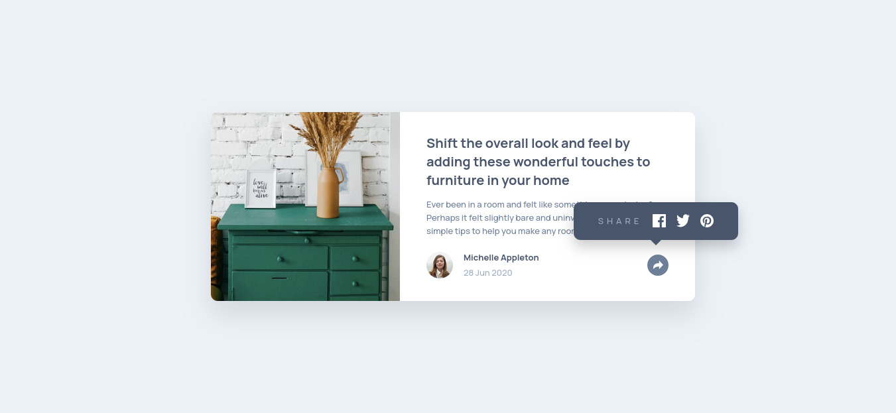
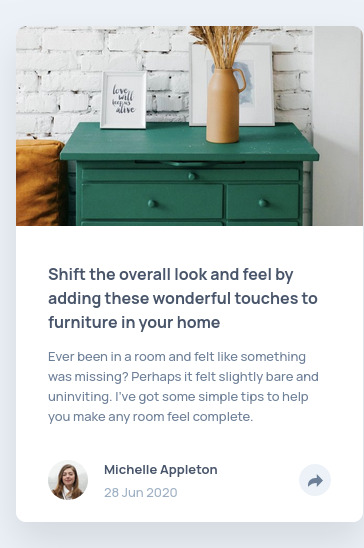

# Frontend Mentor - Article preview component solution

This is a solution to the [Article preview component challenge on Frontend Mentor](https://www.frontendmentor.io/challenges/article-preview-component-dYBN_pYFT). Frontend Mentor challenges help you improve your coding skills by building realistic projects.

## Table of contents

- [Overview](#overview)
  - [The challenge](#the-challenge)
  - [Screenshot](#screenshot)
  - [Links](#links)
- [My process](#my-process)
  - [Built with](#built-with)
  - [What I learned](#what-i-learned)
  - [Continued development](#continued-development)
- [Author](#author)

## Overview

### The challenge

Users should be able to:

- View the optimal layout for the component depending on their device's screen size
- See the social media share links when they click the share icon
- Toggle the share menu by clicking the share button
- Close the share menu by clicking outside of it

### Screenshot




### Links

- Solution URL: [GitHub Repository](https://github.com/ImadBengreine/article-preview-component)
- Live Site URL: [Live Demo](https://imadbengreine.github.io/article-preview-component)

## My process

### Built with

- Semantic HTML5 markup
- CSS custom properties
- Flexbox
- Mobile-first workflow
- Vanilla JavaScript
- CSS transitions and animations

### What I learned

This project helped me improve my understanding of several key concepts:

**1. Responsive Positioning**

I learned how to create different positioning behaviors for mobile and desktop views. The share popup appears as an overlay on mobile but as a tooltip on desktop:

```css
/* Mobile - replaces footer */
.share-menu {
  position: absolute;
  left: -32px;
  right: -32px;
  top: -20px;
  bottom: -20px;
}

/* Desktop - tooltip above button */
@media (min-width: 768px) {
  .share-menu {
    right: -105px;
    bottom: 60px;
    width: 248px;
  }
}
```

**2. CSS Pseudo-elements for Tooltips**

Creating a speech bubble arrow using the `::after` pseudo-element was a great learning experience:

```css
.share-menu::after {
  content: '';
  position: absolute;
  bottom: -8px;
  left: 50%;
  transform: translateX(-50%);
  border-left: 12px solid transparent;
  border-right: 12px solid transparent;
  border-top: 12px solid var(--Dark-Grayish-Blue);
}
```

**3. Click Outside Detection**

Implementing a click-outside handler to close the share menu improved the user experience:

```js
document.addEventListener("click", (e) => {
  if (!shareMenu.contains(e.target) && !shareBtn.contains(e.target)) {
    shareBtn.classList.remove("active");
    footer.classList.remove("active");
    shareMenu.classList.remove("active");
  }
});
```

**4. Mobile vs Desktop Behavior**

I learned to create completely different UI behaviors for mobile and desktop while maintaining the same HTML structure. On mobile, the share menu replaces the entire footer, while on desktop it appears as a floating tooltip.

### Continued development

In future projects, I want to focus on:

- Implementing keyboard accessibility (Escape key to close, Tab navigation)
- Adding smooth animations with CSS transitions
- Exploring CSS Grid for more complex layouts
- Learning about ARIA attributes for better accessibility

## Author

- GitHub - [@ImadBengreine](https://github.com/ImadBengreine)
- Frontend Mentor - [@ImadBengreine](https://www.frontendmentor.io/profile/ImadBengreine)